# Heart Guardian AI - Demo Documentation

> A comprehensive demonstration of Heart Guardian AI - a mental health support platform for political trauma survivors.

## Overview

Heart Guardian AI provides three core capabilities:
1. **24/7 AI Emotional Support** - Always-available AI companion for emotional support
2. **Intelligent Risk Detection** - Multi-language crisis intervention system
3. **Secure Doctor-Patient Communication** - HIPAA-compliant messaging and data management

---

## Part 1: Patient Portal

### 1.1 Login Page with Multi-Language Support

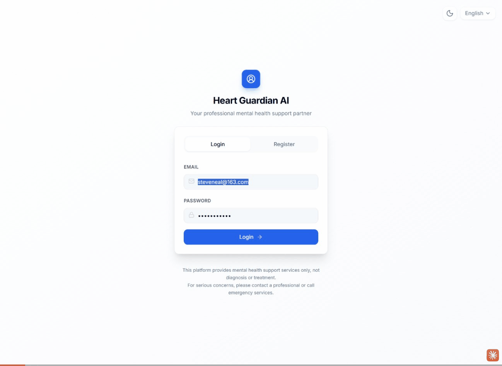

**Features Demonstrated:**
- Clean, professional login interface
- **12+ Language Support**: English, Chinese, French, Spanish, Farsi, Hindi, Punjabi, Bengali, Urdu, Tamil, Haitian Creole, Arabic
- Patient/Doctor account distinction
- Theme toggle (dark/light mode)

**Login Credentials:**
- Patient: `patient.emily@demo.com` / `Demo123!`
- Doctor: `dr.sarah@demo.com` / `Demo123!`

---

### 1.2 Patient Dashboard

**Features:**
- Time-based personalized greeting (Good Morning/Afternoon/Evening)
- Quick Mood Check with 5 emoji options
- Quick action cards:
  - **Talk to AI** - Immediate emotional support
  - **Health Center** - Check-ins & assessments
  - **Appointments** - View upcoming sessions
- Inspirational quotes
- Bottom navigation bar

---

### 1.3 AI Chat with Risk Detection (KEY FEATURE)

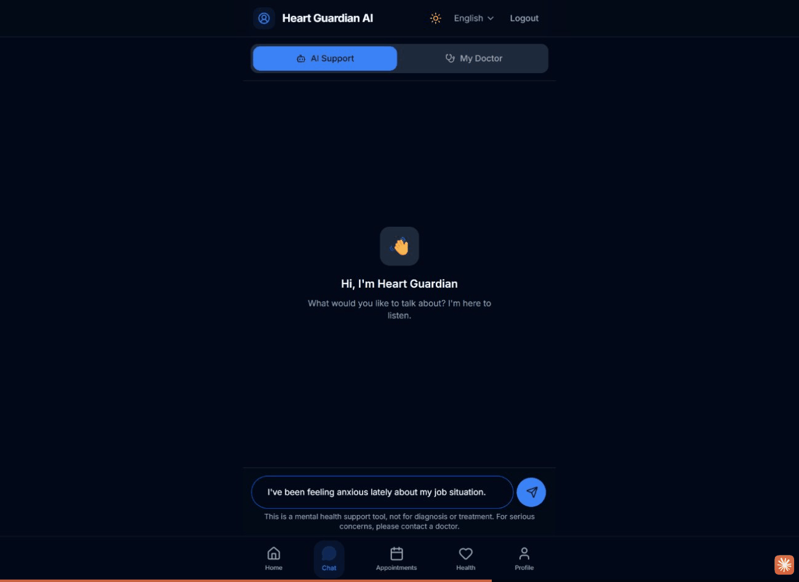

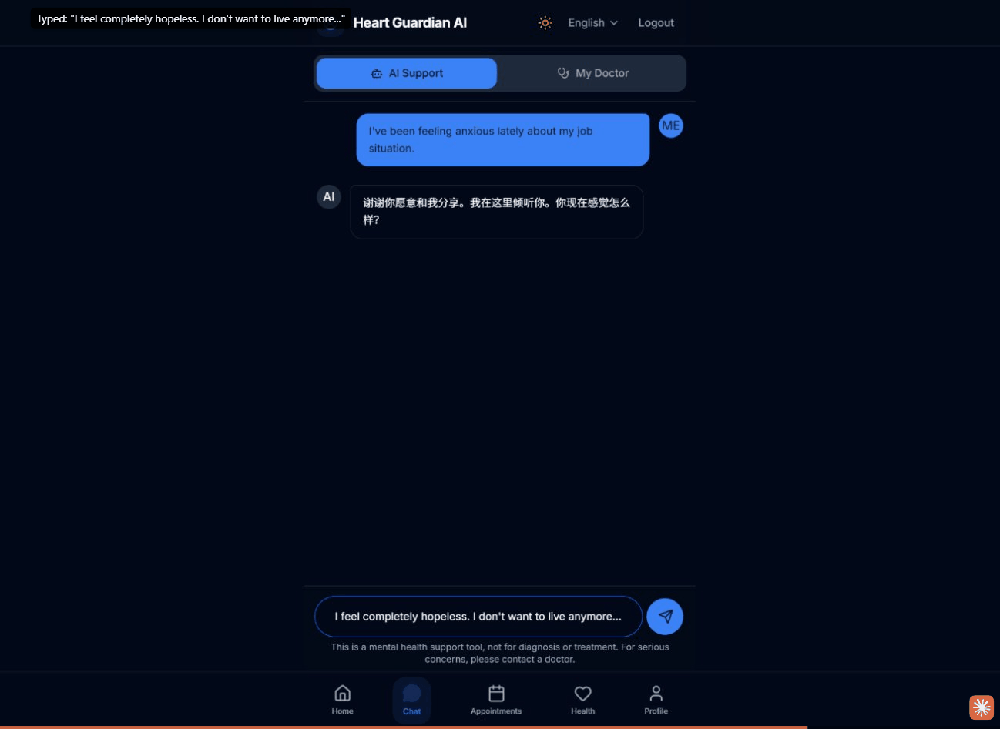

**Features Demonstrated:**
- Real-time AI emotional support chat
- **Automatic Risk Detection** - Detects suicidal ideation and crisis signals
- **Crisis Intervention Modal** showing:
  - Emergency hotline numbers (911, 988)
  - Automatic doctor notification
  - "I understand" acknowledgment button
- **Empathetic AI Response** with:
  - Acknowledgment of feelings
  - Crisis resources
  - Safety check questions

**Trigger Text Example:**
> "I feel completely hopeless. I don't want to live anymore..."

**System Response:**
- Displays "We're worried about you" modal
- Shows emergency contacts
- Notifies treating physician (Dr. Sarah Mitchell)
- AI provides empathetic response with crisis resources

---

### 1.4 Health Center - Daily Check-in & Assessments

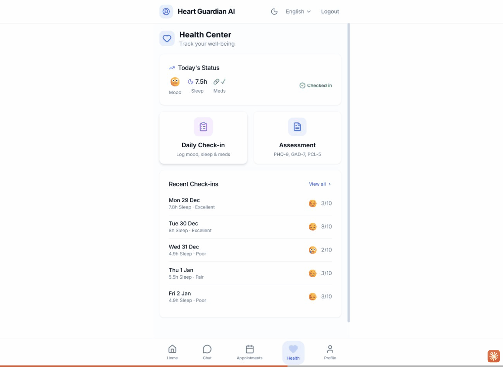

**Daily Check-in Features:**
- Mood score (0-10 scale with emoji)
- Sleep duration and quality tracking
- Medication adherence tracking
- Optional notes field
- Recent check-ins history

**Assessment Scales:**
- **PHQ-9** - Depression Screening (9 questions, ~2 min)
- **GAD-7** - Anxiety Screening (7 questions, ~2 min)
- **PCL-5** - Trauma Screening (8 questions, ~3 min)
  - *Recommended for political persecution survivors*

**Privacy Notice:**
> "Your responses are confidential and stored securely in Canada. They will only be shared with your healthcare provider and never with any government."

---

### 1.5 PHQ-9 Assessment Flow

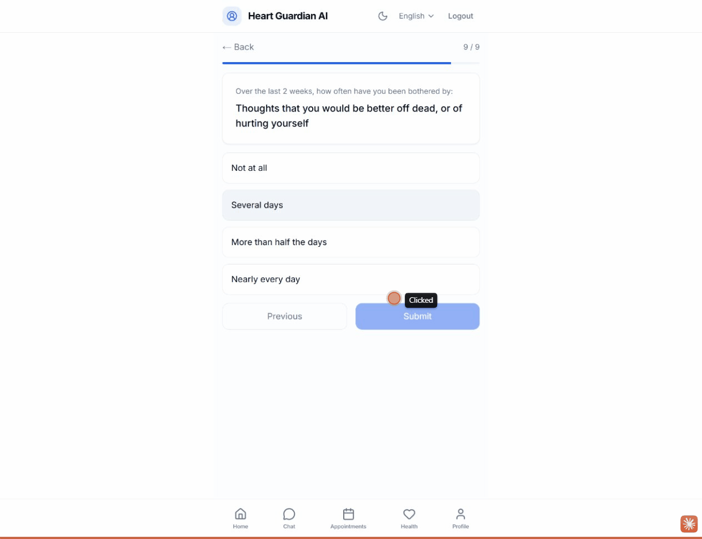

**Features Demonstrated:**
- Step-by-step question progression (9 questions)
- Progress indicator showing question count (e.g., "3/9")
- Four response options per question:
  - Not at all
  - Several days
  - More than half the days
  - Nearly every day
- Previous/Next navigation buttons
- **Assessment Results** page showing:
  - Total score (e.g., "7 out of 27")
  - Severity classification (Mild, Moderate, Severe)
  - Disclaimer about seeking professional help

---

### 1.6 My Appointments

**Features:**
- View upcoming appointments with healthcare provider
- Appointment cards showing:
  - Doctor name and specialty
  - Date and time
  - Appointment type (Follow-up, Consultation)
  - Status badges (Confirmed, Pending)
- Cancel appointment option
- Appointment preparation reminders

---

### 1.7 Patient Profile

**Features:**
- **My Doctor** section: View connected healthcare provider
- **Personal Information**: Name, DOB, gender, phone, address
- **Emergency Contact**: Collapsible section
- **Medical Information**: Collapsible section
- **Mental Health Context**: Collapsible section
- **Save Profile** button
- **Data Export** option for GDPR compliance

---

### 1.8 Doctor-Patient Messaging

**Features:**
- Direct communication with treating physician
- Full conversation thread history
- Support for text, images, and file attachments
- Message timestamps
- Read status indicators

---

## Part 2: Doctor Portal

### 2.1 Patient List

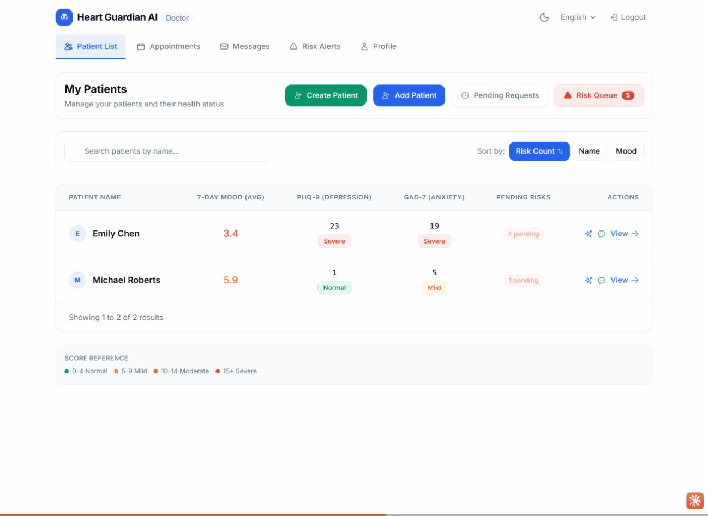

**Features:**
- Complete patient overview
- Key metrics displayed:
  - 7-Day Mood Average
  - PHQ-9 (Depression) Score with severity badge
  - GAD-7 (Anxiety) Score with severity badge
  - Pending Risk Events count
- **Search** and **Sort** functionality (by Risk Count, Name, Mood)
- Quick actions: Create Patient, Add Patient, Risk Queue
- Score Reference legend (Normal, Mild, Moderate, Severe)

---

### 2.2 Risk Event Queue (KEY FEATURE)

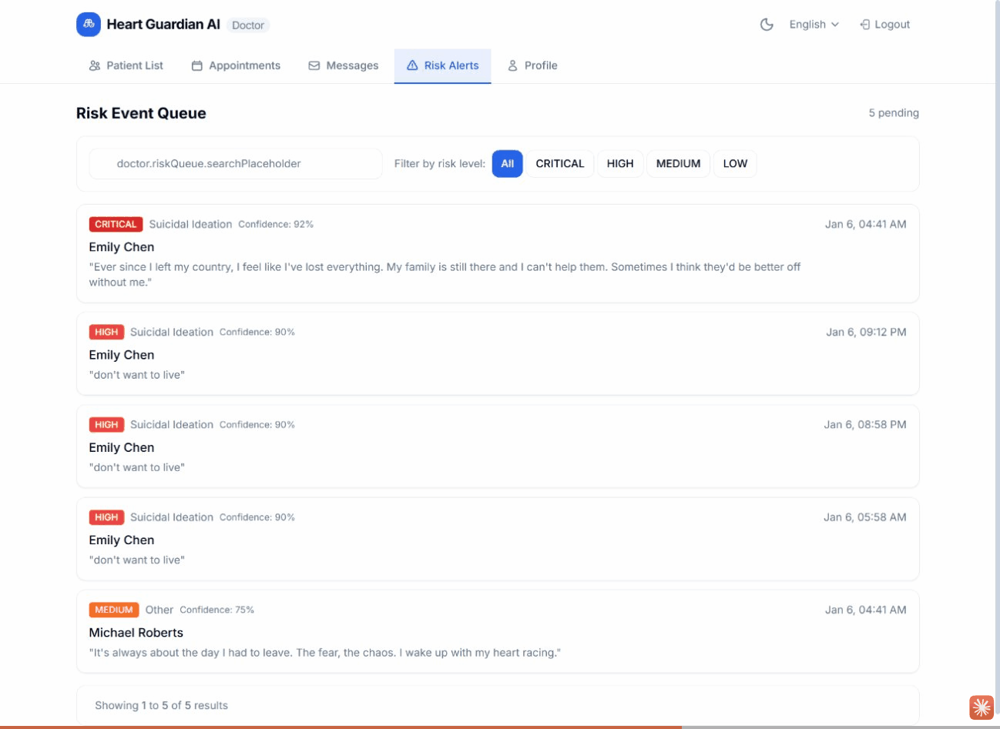

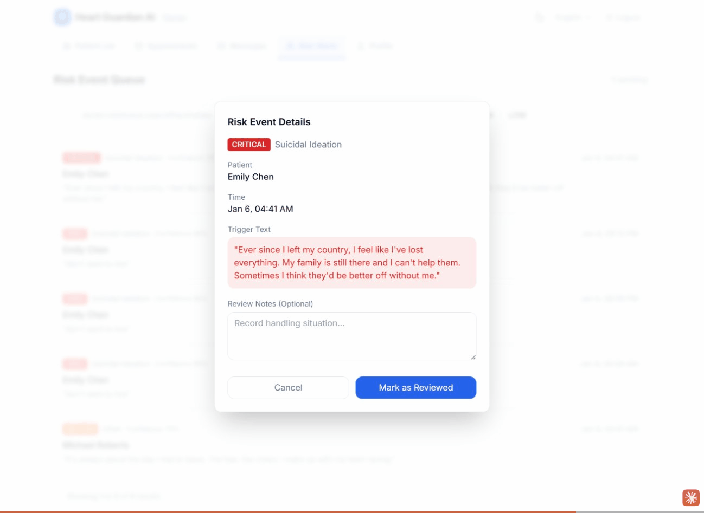

**Features:**
- Real-time risk alerts from AI detection
- **Severity Levels:**
  - 🔴 **CRITICAL** - Immediate attention required
  - 🟠 **HIGH** - Urgent review needed
  - 🟡 **MEDIUM** - Monitor closely
  - 🟢 **LOW** - Standard review
- Filter by risk level
- **Risk Event Details Modal:**
  - Severity badge
  - Patient name
  - Timestamp
  - **Trigger text** (highlighted)
  - AI confidence score (e.g., 92%)
  - Review notes field
  - "Mark as Reviewed" button

**Example Critical Event:**
> "Ever since I left my country, I feel like I've lost everything. My family is still there and I can't help them. Sometimes I think they'd be better off without me."

---

### 2.3 Patient Details

**Sections:**
- **Patient Header** - Name, age, gender, phone, location
- **Emergency Contact** - Name, relationship, phone
- **Medical Information:**
  - Current Medications
  - Medical Conditions
  - Allergies (highlighted in red)
- **Mental Health Context:**
  - Therapy History
  - Mental Health Goals
  - Support System
  - Known Triggers
  - Coping Strategies
- **Generate Pre-Visit Report** button
- **30-Day Mood Trend** chart visualization
- **Check-in History** with daily entries

**Quick Actions:**
- AI Assistant (for patient summary queries)
- Send Message

---

### 2.4 AI Clinical Assistant (KEY FEATURE)

**Features Demonstrated:**
- Patient-specific AI assistant for clinical support
- **Quick Action Buttons:**
  - "Analyze this patient's mood trends over the past 2 weeks"
  - "What risk factors should I be aware of?"
  - "Summarize the patient's recent check-ins"
  - "What treatment approaches might be helpful?"
- Custom query input for specific questions
- Conversation history with History button
- New conversation option
- **Disclaimer:** "AI suggestions are for informational purposes only. Clinical decisions remain with the treating physician."

---

### 2.5 Appointment Management

**Features:**
- **Statistics Dashboard:**
  - Today's Appointments count
  - Pending appointments count
  - Confirmed appointments count
  - This Week Total
- **Calendar View:**
  - Monthly calendar with appointment indicators
  - Click any date to view appointments
- **Appointment Cards:**
  - Patient name
  - Appointment type (Follow-up, Consultation)
  - Time slot
  - Status badge (Confirmed, Pending)
- **Action Buttons:**
  - Complete - Mark appointment as completed
  - No Show - Mark patient as no-show
  - Cancel - Cancel the appointment
- **Create Appointment** button

---

### 2.6 Doctor Messages

**Features:**
- Patient conversation list with:
  - Patient avatar and name
  - Message preview
  - Timestamp
  - Unread message badge
- Search conversations functionality
- **Conversation View:**
  - Full message history
  - Doctor messages (blue, right-aligned)
  - Patient messages (white, left-aligned)
  - Timestamps for each message
  - Read receipts (double checkmarks)
- **Message Input:**
  - Text input field
  - Image attachment option
  - File attachment option
  - Send button

---

## Part 3: Special Features

### 3.1 Multi-Language Support

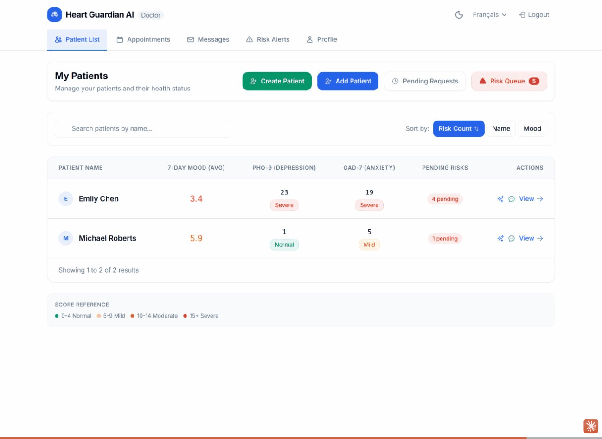

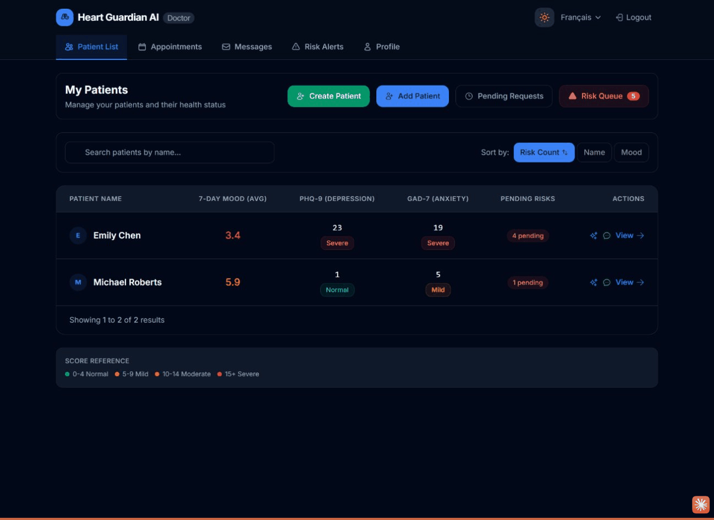

**Supported Languages (12+):**
- English
- 中文 (Chinese)
- Français (French)
- Español (Spanish)
- فارسی (Farsi/Persian)
- हिन्दी (Hindi)
- ਪੰਜਾਬੀ (Punjabi)
- বাংলা (Bengali)
- اردو (Urdu)
- தமிழ் (Tamil)
- Kreyòl Ayisyen (Haitian Creole)
- العربية (Arabic)

**Features:**
- Instant language switching (no page refresh)
- Optimized for refugee/immigrant populations
- Risk detection works across all supported languages

---

### 3.2 Dark/Light Theme

**Features:**
- Eye-friendly dark mode
- One-click toggle
- Automatic system preference detection
- Color-coded sections maintained in both themes

---

### 3.3 Responsive Design

**Features:**
- Mobile-first responsive design
- Bottom navigation bar on mobile
- Card-based layout
- Touch-friendly buttons
- PWA support for offline access

---

## Demo Accounts

| Role | Email | Password |
|------|-------|----------|
| Patient (High Risk) | `patient.emily@demo.com` | `Demo123!` |
| Patient (Medium Risk) | `patient.michael@demo.com` | `Demo123!` |
| Doctor | `dr.sarah@demo.com` | `Demo123!` |

---

## Key Takeaways

1. **AI Companion** - 24/7 emotional support, always available
2. **Risk Detection** - Multi-language, automatic detection protecting lives at critical moments
3. **Privacy First** - Patients have complete control over their data
4. **Accessible** - 12+ languages, responsive design, dark mode support

---

## Part 4: Additional Feature Demos

### 4.1 Connection Requests Management

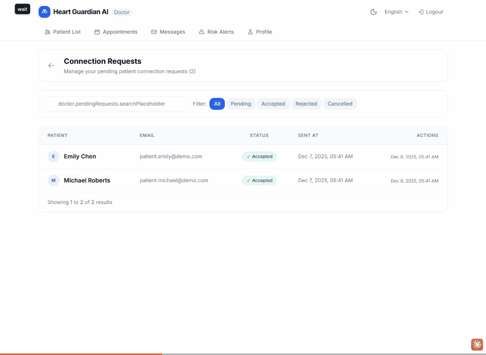

**Features Demonstrated:**
- **Connection Requests List** - Manage doctor-patient connection requests
- **Status Filters:**
  - All - View all requests
  - Pending - Awaiting response
  - Accepted - Approved connections
  - Rejected - Declined requests
  - Cancelled - Withdrawn requests
- Request details including patient email and timestamps
- Search functionality for finding specific requests

---

### 4.2 Appointment Calendar View

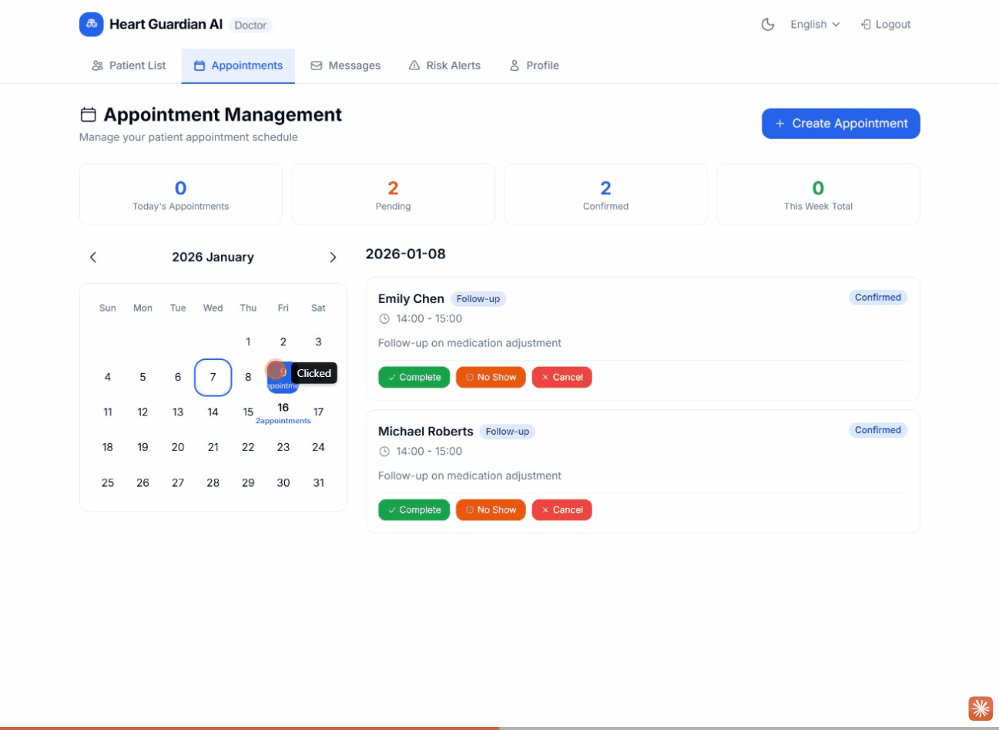

**Features Demonstrated:**
- **Statistics Dashboard:**
  - Today's Appointments
  - Pending appointments
  - Confirmed appointments
  - This Week Total
- **Interactive Calendar:**
  - Monthly view with appointment indicators
  - Date selection to view specific appointments
  - Month navigation (previous/next)
- **Appointment Cards showing:**
  - Patient name and appointment type
  - Time slot (e.g., 14:00-15:00)
  - Status badge (Confirmed/Pending)
  - Action buttons (Complete, No Show, Cancel)

---

### 4.3 Doctor-Patient Messaging

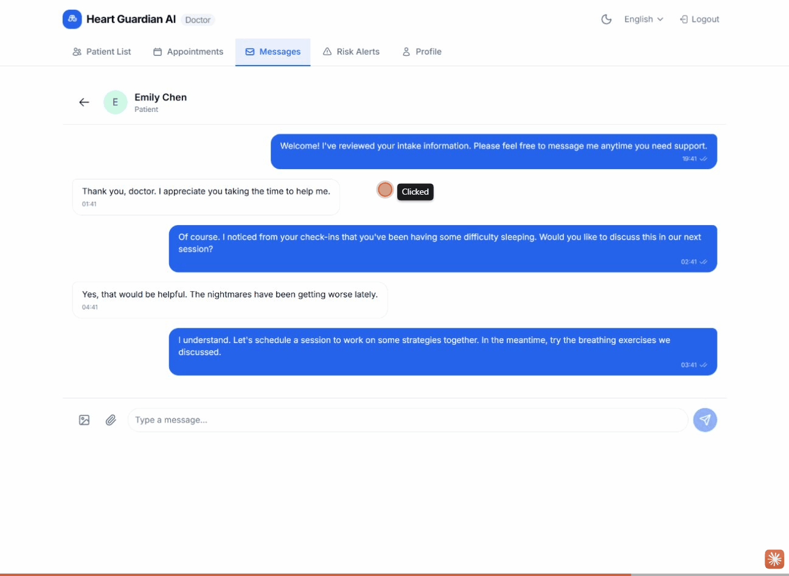

**Features Demonstrated:**
- **Conversation List:**
  - Patient avatars and names
  - Message preview text
  - Timestamp (e.g., "Yesterday")
  - Unread message count badges
- **Chat Interface:**
  - Full conversation history
  - Doctor messages (blue bubbles, right-aligned)
  - Patient messages (gray bubbles, left-aligned)
  - Message timestamps with read receipts
- **Message Input:**
  - Text input field
  - Image attachment button
  - File attachment button
  - Send button

---

### 4.4 User Profile & Registration

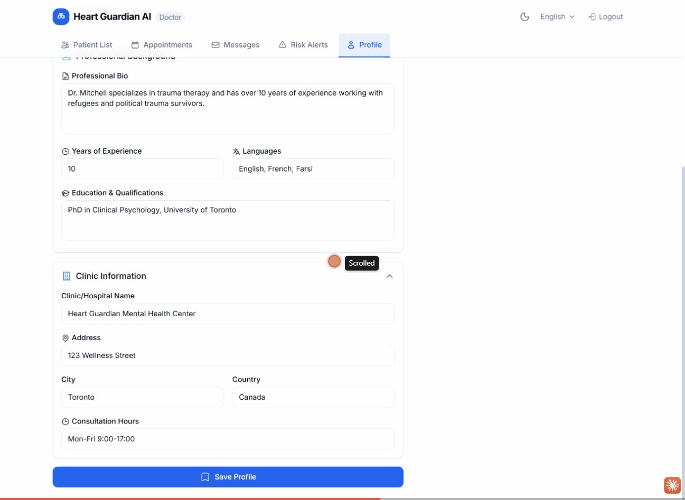

**Features Demonstrated:**
- **Doctor Profile Page:**
  - Personal Information (Name, Specialty, License Number, Phone)
  - Professional Background (Bio, Years of Experience, Languages, Education)
  - Clinic Information (Name, Address, City, Country, Consultation Hours)
  - Save Profile button
- **Login/Register Toggle:**
  - Login tab with email/password
  - Register tab with full registration form
- **Registration Form:**
  - First Name, Last Name
  - Email, Password
  - **Identity Selection:** Patient or Doctor
  - Register Now button

---

### 4.5 Patient Details & Health History

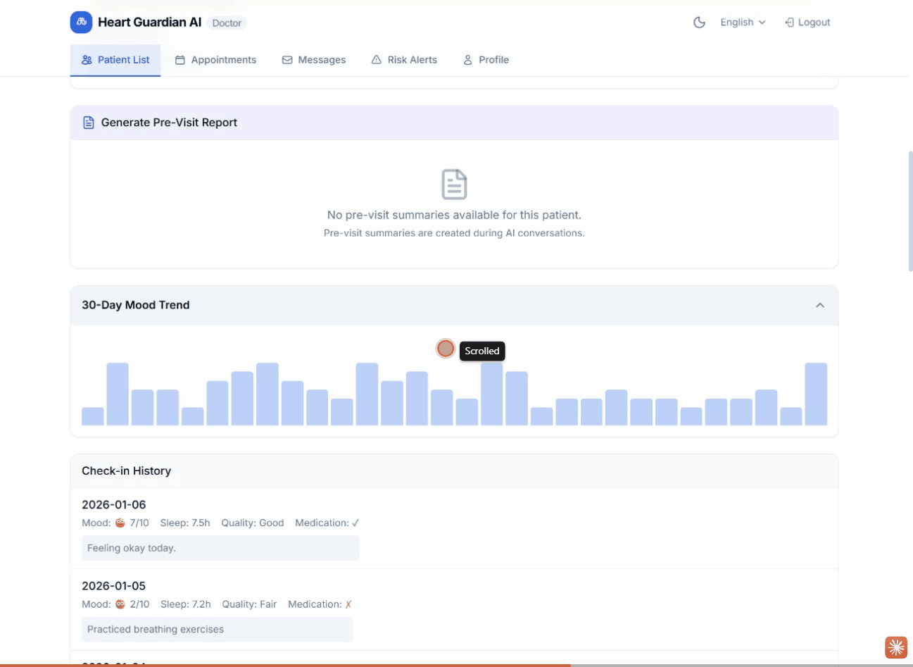

**Features Demonstrated:**
- **Patient Header:**
  - Name, age, gender, phone number
  - Location information
- **Emergency Contact Section:**
  - Contact name, relationship, phone number
- **Medical Information:**
  - Current Medications
  - Medical Conditions
  - Allergies (highlighted)
- **Mental Health Context:**
  - Therapy History
  - Mental Health Goals
  - Support System
  - Known Triggers
  - Coping Strategies
- **Pre-Visit Report Section:**
  - Generate report functionality
- **30-Day Mood Trend Chart:**
  - Visual bar chart of daily mood scores
- **Check-in History:**
  - Daily entries with mood score, sleep duration, quality
  - Medication adherence tracking
  - Personal notes/activities

---

## Screenshots Reference

All screenshots are located in the `screenshots/` folder:

| File | Description |
|------|-------------|
| `01_login_page.png` | Login interface with language/theme toggles |
| `02_patient_dashboard.png` | Patient dashboard with mood check |
| `02_ai_chat_crisis_modal.png` | Crisis detection modal with emergency resources |
| `03_health_center.png` | Health center overview |
| `04_daily_checkin.png` | Daily check-in form |
| `05_doctor_patient_list.png` | Doctor portal patient list |
| `06_risk_queue.png` | Risk event queue |
| `07_risk_event_details.png` | Risk event review modal |
| `08_dark_mode.png` | Dark theme with French language |
| `09_light_mode.png` | Light theme with French language |
| `11_phq9_question.png` | PHQ-9 assessment question |
| `12_phq9_results.png` | PHQ-9 assessment results |
| `13_ai_assistant.png` | AI Clinical Assistant interface |
| `14_ai_assistant_response.png` | AI Assistant conversation response |
| `15_doctor_appointments.png` | Doctor appointment management calendar |
| `16_appointment_details.png` | Appointment details with action buttons |
| `17_doctor_messages.png` | Doctor-patient messaging conversation |
| `18_patient_ai_chat.png` | Patient AI emotional support chat |
| `19_risk_queue_detail.png` | Risk event queue with multiple alerts |
| `20_connection_requests.png` | Connection requests management |
| `21_appointments_calendar.png` | Appointments calendar view |
| `22_messages_conversation.png` | Doctor-patient messaging |
| `23_profile_registration.png` | User profile and registration |
| `24_patient_details_history.png` | Patient details with health history |

### Screenshot Previews

#### Login Page

#### Patient Dashboard
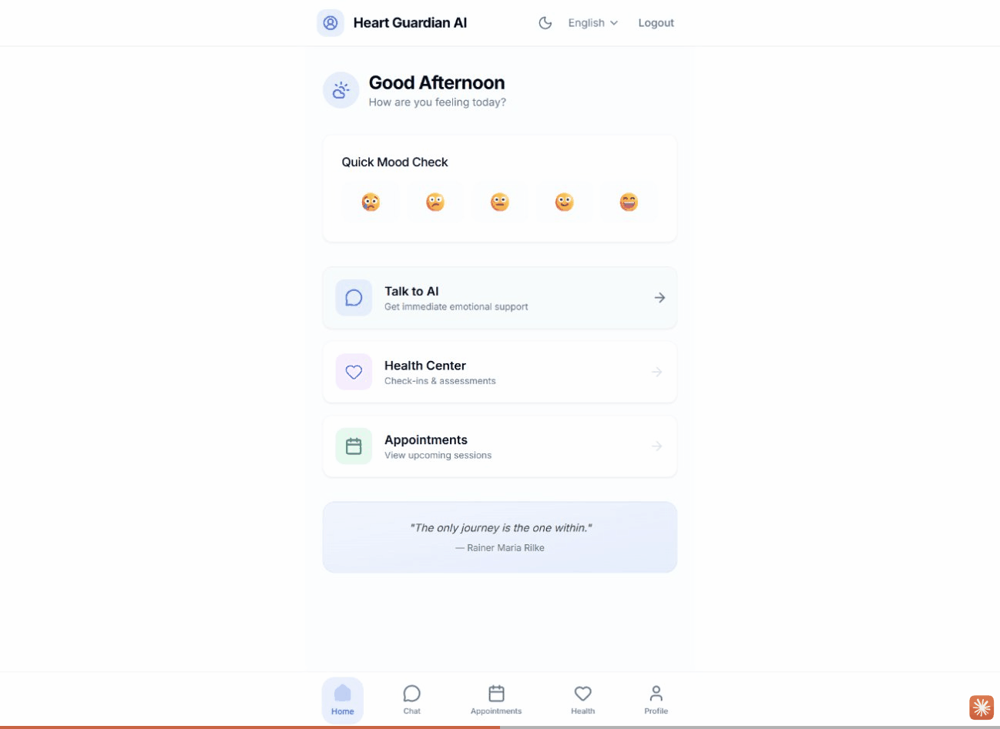

#### Crisis Detection Modal

#### Health Center

#### Daily Check-in

#### Doctor Patient List

#### Risk Queue

#### Risk Event Details

#### Multi-Language Dark Mode

#### Multi-Language Light Mode

#### PHQ-9 Assessment Question

#### PHQ-9 Assessment Results

#### AI Clinical Assistant
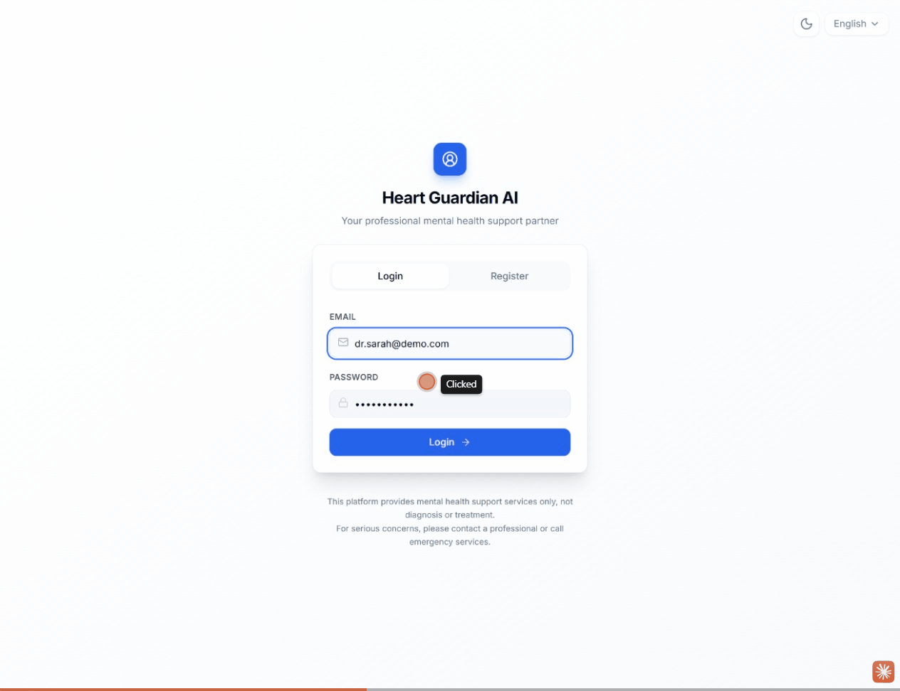

#### AI Assistant Response
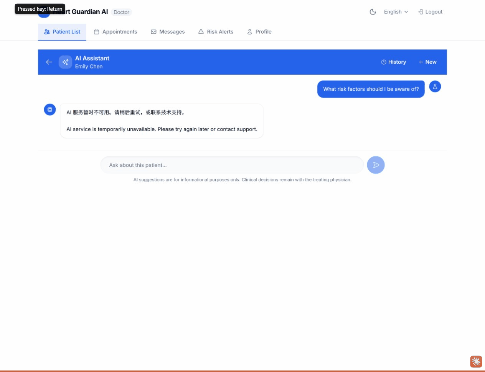

#### Doctor Appointments Calendar
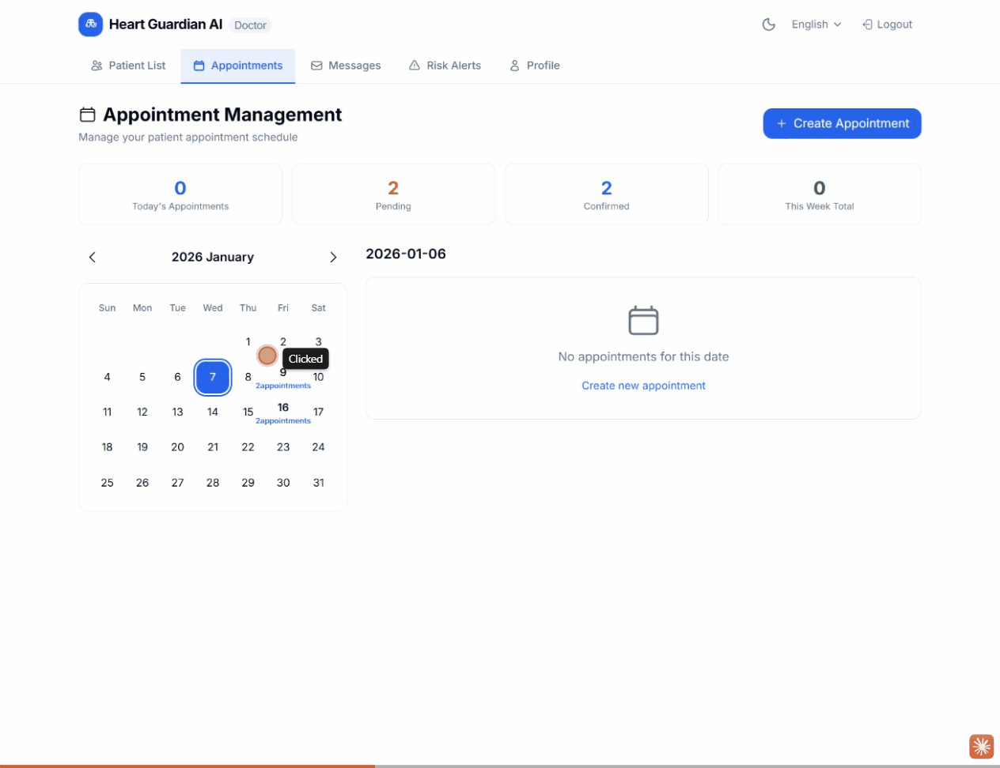

#### Appointment Details
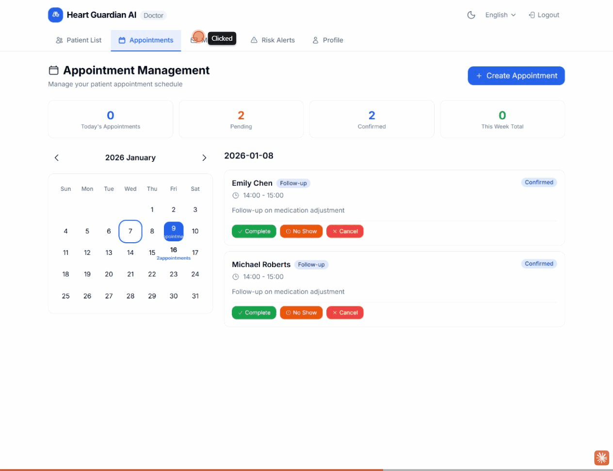

#### Doctor-Patient Messages
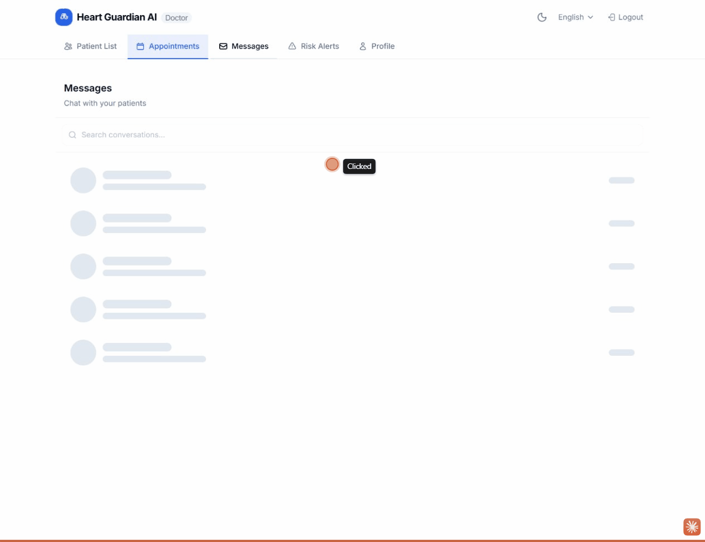

#### Patient AI Chat

#### Risk Queue Detail
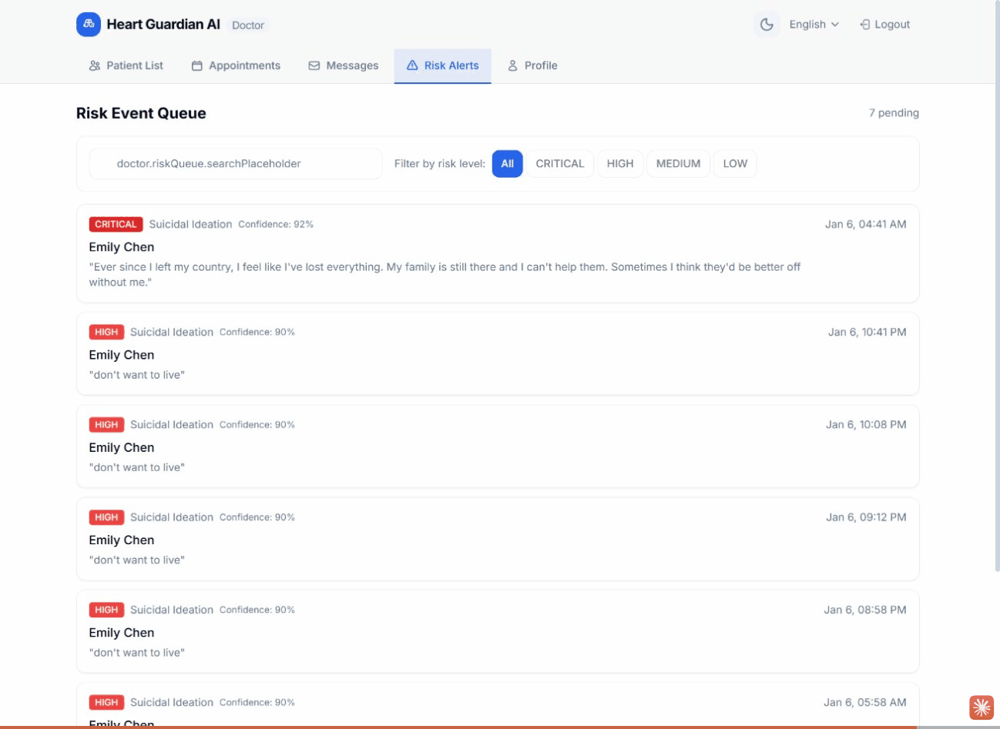

#### Connection Requests

#### Appointments Calendar

#### Messages Conversation

#### Profile & Registration

#### Patient Details & History

---

*Demo recorded: January 2026*
*Screenshots updated: January 7, 2026*
*Platform: Heart Guardian AI v1.0*
